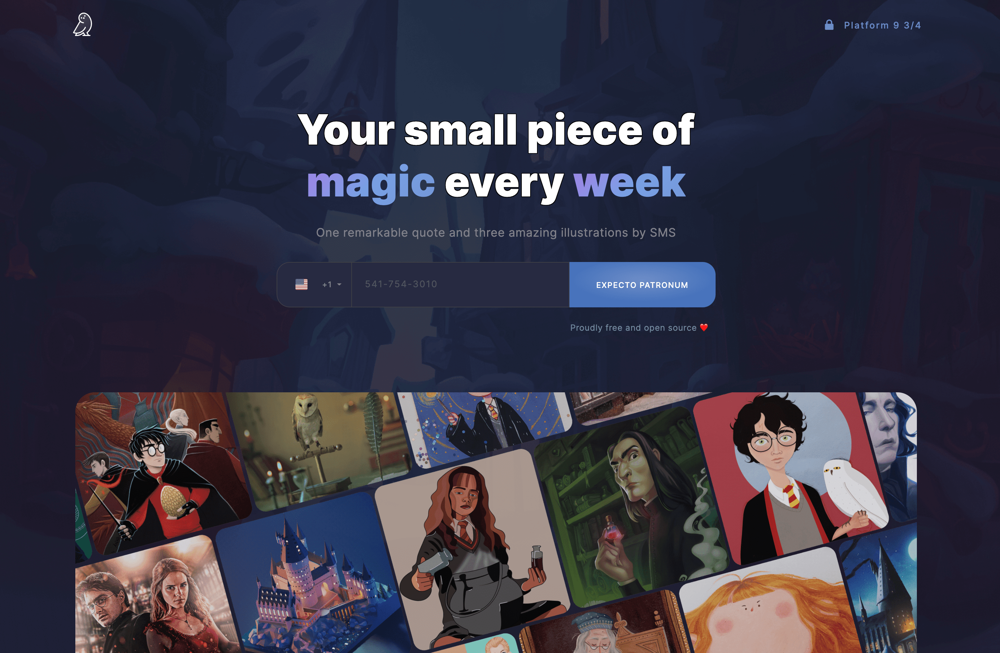

# Owl Hedwig 🦉 

Owl Hedwig is a simple all-in-one project built with React and Typescript to send ongoing quotes and illustrations from Harry Potter for its fans by SMS for free. I manually curated its database, and its content was harvested from the best artists you can find on Behance, Pinterest and Dribble.

If you are a big fan of Harry Potter and want to give it a try and share your feedback ❤️

 

> 🪄 **Check it out:** [https://hedwig.app](https://hedwig.app)

 

### <strong>In a nutshell</strong>

 

* **[Create React App](https://create-react-app.dev/)** - get our React project off the ground.
* **[Netlify](https://www.netlify.com/)** - deployment for front (CI/CD) and backend services (FaaS with AWS lambda).
* **[Github](https://github.com/)** - git repository and auto-deployment on Netlify.
* **[Cloudflare](https://www.cloudflare.com/)** - CDN platform (plus... SSL, cache, DDoS protection, Latency reduction)
* **[Typescript](https://www.typescriptlang.org/)** - vanilla JS superset both on front and backend development.
* **[Bootstrap 5.0](https://getbootstrap.com/)** - efficient solution for responsiveness.
* **[Figma](https://www.figma.com)** - to design the platform and the high-fidelity prototype [check it out](https://www.figma.com/file/UgtmmAWKj3bnREjemiuCYL/Owl-Hedwig?node-id=0%3A1).
* **[Twilio](https://www.twilio.com/)** - SMS sender at low cost and incredible speed.
* **[MongoDB](https://www.mongodb.com/3)** - NoSQL storage facility.
* **[EasyCron](https://www.easycron.com)** - call our endpoints every day.
* **[UptimeRobot](https://uptimerobot.com/)** - let us know in case of suspicious activities.
* **[Apilayer](https://apilayer.com/)** - to validate the phone numbers before sending the messages.
* **[Google Tag Manager](https://marketingplatform.google.com/intl/en_uk/about/tag-manager/)** - monitor the usage of our solution (GA 4.0 and Yandex Metrica).
* **[Rebrandly](https://www.rebrandly.com/)** - branded short links to unsubscribe.

 

# How it looks like

 

# About me

👍 Give me a shout on [Twitter](https://twitter.com/gustavotdsilva) or [LinkedIn](https://www.linkedin.com/in/gustavotoledosilva/).